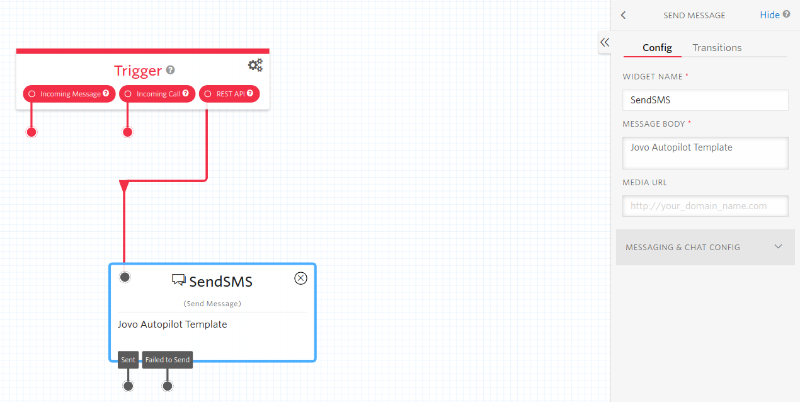

# Jovo Template: Send an SMS on Twilio Autopilot

This template contains a Jovo Sample Autopilot Bot that can send a SMS to the user.

## Quick Start

To use the Jovo Templates, you'll need the Jovo CLI. You can install it globally with NPM.

```sh
$ npm install -g jovo-cli
```

After successfully installing the Jovo CLI, you can install the template using one of the following commands:

```sh
$ jovo new <directory> --template autopilot/sms
```

> Read more about `jovo new` [here](https://www.jovo.tech/marketplace/jovo-cli#jovo-new).

Change your working directory into your newly created project directory and run your voice app:

```sh
# Change working directory to your previously specified directory.
$ cd <directory>

# Install dependencies.
$ npm install
```
Before you actually run the voice app, you need to add your Workflow's ID to the marked section in the handler.

```sh  
# Run voice app, optionally with a --watch flag to restart on code changes.
$ jovo run [-w]
```

> Read more about `jovo run` [here](https://www.jovo.tech/marketplace/jovo-cli#jovo-run).

## Next Steps

Now that you got the template running, it is time that you build your corresponding Autopilot bot! To get started, you can take a look at a tutorial [here](https://www.jovo.tech/tutorials/twilio-autopilot-hello-world). For this template, we recommend using a simple flow with a Send Message widget triggered by the REST API:



To see what else you can do with the Jovo Framework, take a look at the [Jovo Documentation](https://www.jovo.tech/docs/).

## About Jovo

Jovo is the most popular development framework for voice, including platforms like Alexa, Google Assistant, mobile apps, and Raspberry Pi.

-   [Jovo Website](https://jovo.tech/)
-   [Documentation](https://jovo.tech/docs/)
-   [Marketplace](https://www.jovo.tech/marketplace/)
-   [Twitter](https://twitter.com/jovotech/)
-   [Forum](https://community.jovo.tech/)
